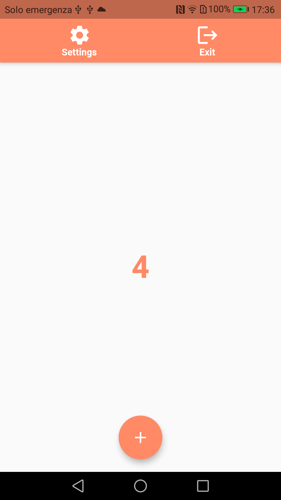
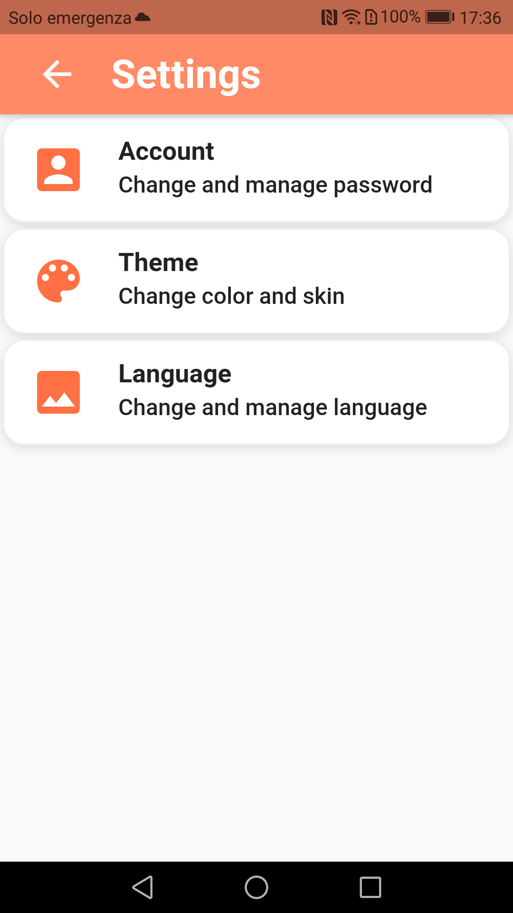
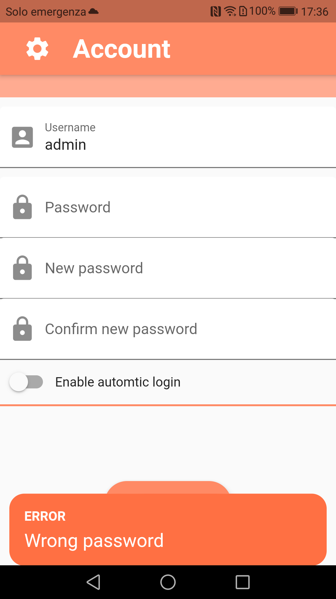
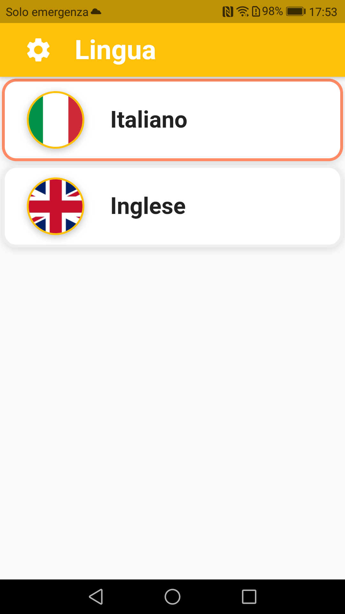
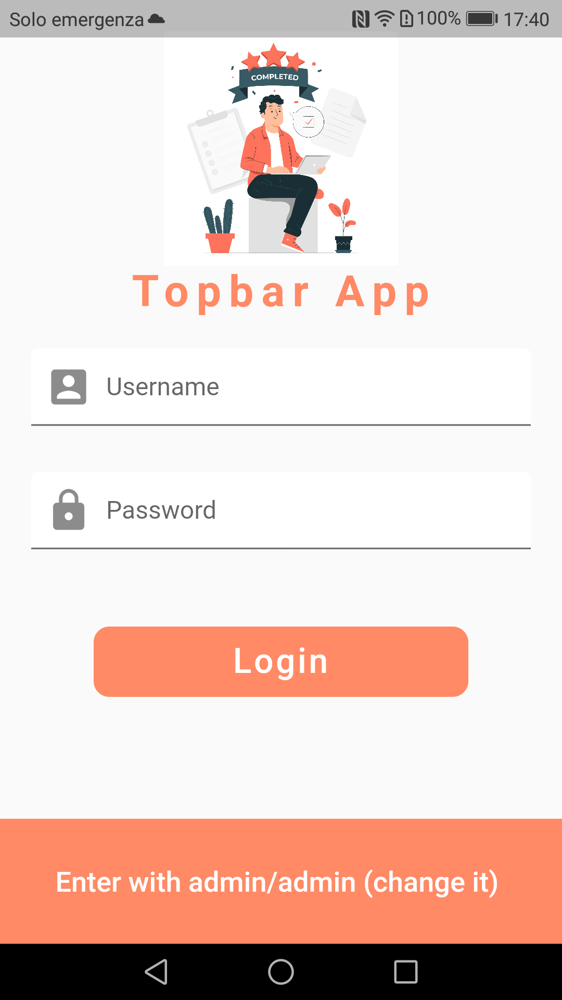
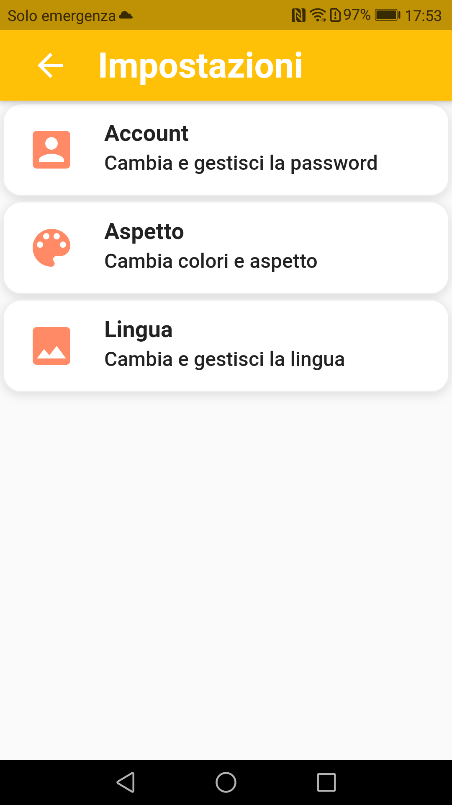
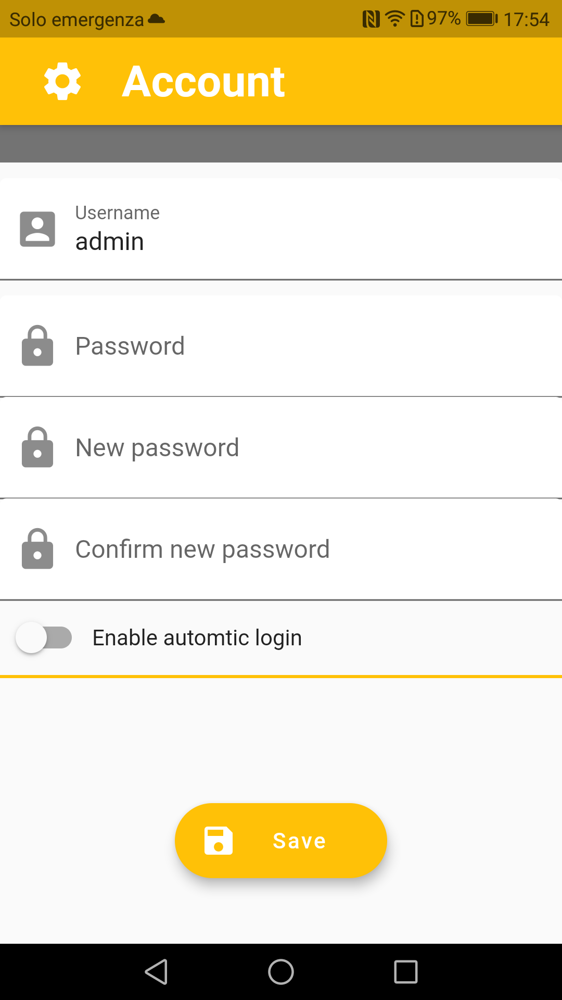
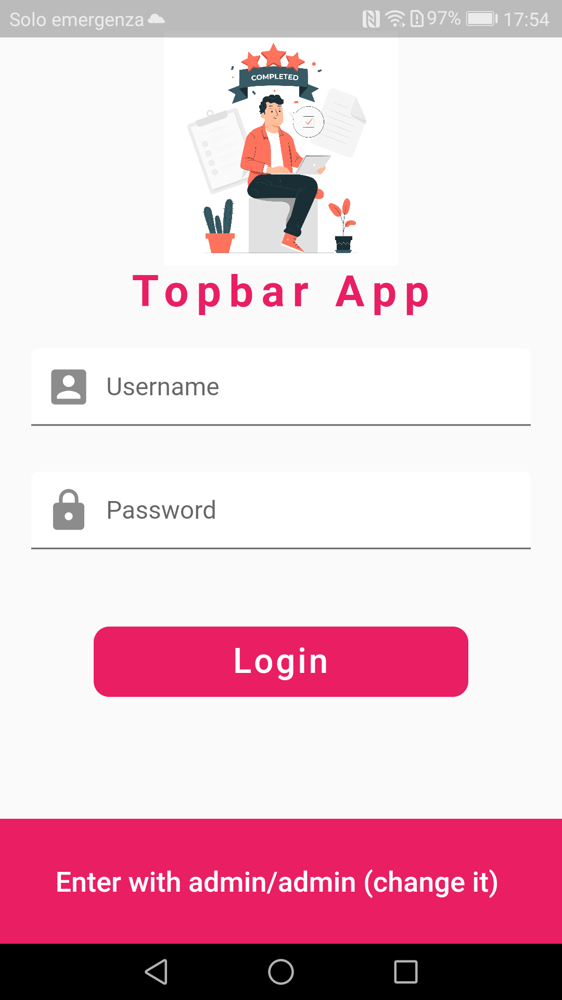

# Topbar app Template
Flutter template app based on GetX with Login, Theme management, i18n and local persistence. <br>
If you want to try it download apk at this link https://github.com/rosidotidev/topbar_app/blob/main/file/topbar-1_0.apk

#### Supported features:
- Login
- Top bar menu
- Account (username, password, autilogin) management
- i18n management; supported italian and english 
- Change theme 
- Persistence with Sembast

#### Getting Started:

1. Clone the repo from https://github.com/rosidotidev/topbar_app.git
2. run ```flutter run ```
3. Remember: first time login with admin/admin

#### Screenshots:

 <br>
 <br>
 <br>
 <br>

#### Credits:

- GetX framework (Best state management library)
- FreePik
- Sembast local storage